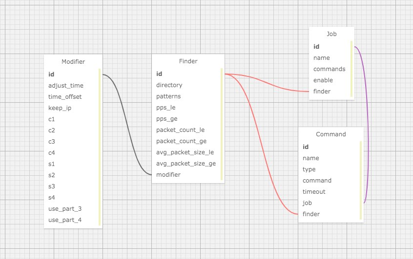

跟流量相关的日常测试，就是 根据条件查找 pcap, 修改 pcap, 然后利用修改后的 pcap 执行某些软件命令的过程

##### 1. 查找 pcap 通常可能用到的条件
- 在指定的目录内查找
- 按照 平均包大小 范围查找
- 按照 PPS 范围查找
- 按照 文件名称 模糊查找
- 按照 包数量 范围查找

##### 2. 修改 pcap 通常会用到的条件
- 是否修改 pcap 内的 packet 时间, 修改到什么时候
- 是否修改 pcap 内的 IP 地址, 修改到什么范围, 多大的范围

##### 3. 执行命令通常会用到的内容
- 命令执行主要是靠相关软件本身的命令行参数, 比如 zeek -r 支持从 pcap 读取数据工作, 此时最需要的就是待测 pcap 的路径
- 有时候可能需要使用不同的 pcap 执行不同的命令， 且有先后顺序关系, 甚至中间需要进行一定时长的等待

#### 基于以上分析, 抽象如下数据结构定义来描述上述概念:

##### 1. 抽象 Finder, 用于定义如何查找 pcap
```go
type Finder struct {
    // finder 的 ID, 默认是 default, 用于 Job 和 Command 引用
	Id              string   `mapstructure:"id"`
    // 从哪个目录查找
	Directory       string   `mapstructure:"directory"` // from user
    // 文件名的模式
	Patterns        []string `mapstructure:"patterns"`
    // 使用的 modifier 的 ID, 默认为 default
	ModifierId      string   `mapstructure:"modifier"`
	// pps 小于 xxx, 默认为 0 无限制
	PpsLE           float64  `mapstructure:"pps_le"`
    // pps 大于 xxx, 默认为 0 无限制
	PpsGE           float64  `mapstructure:"pps_ge"`
    // packet count 小于 xxx, 默认为 0 无限制
	PacketCountLe   int64    `mapstructure:"packet_count_le"`
    // packet count 大于 xxx, 默认为 0 无限制
	PacketCountGe   int64    `mapstructure:"packet_count_ge"`
    // avg packet size 小于 xxx, 默认为 0 无限制
	AvgPacketSizeLE float64  `mapstructure:"avg_packet_size_le"`
    // avg packet size 大于 xxx, 默认为 0 无限制
	AvgPacketSizeGE float64  `mapstructure:"avg_packet_size_ge"`
    
    // ModifierId 找到的 modifier
	modifier        *Modifier
}
```

##### 2. 抽象 Modifier, 用于定义如何修改 pcap
```go
type Modifier struct {
    // modifier 的 ID, 默认是 default, 用于 Finder 引用
	Id string `mapstructure:"id"`
    
    // 定义是否修改时间
	AdjustTime bool          `mapstructure:"adjust_time"`
    // 将时间修改到什么时候, 采用 go time.Duration 表示, 可以使用诸如 1h3m5s 等语法表示
	TimeOffset time.Duration `mapstructure:"time_offset"`
	
    // 是否要保持 IP, 默认是 false, 即 修改 IP
	KeepIp   bool `mapstructure:"keep_ip"`
    // 自定义客户端 IP 的 第 1 段
	C1       int  `mapstructure:"c1"`
    // 自定义客户端 IP 的 第 2 段
	C2       int  `mapstructure:"c2"`
    // 自定义客户端 IP 的 第 3 段
	C3       int  `mapstructure:"c3"`
    // 自定义客户端 IP 的 第 4 段
	C4       int  `mapstructure:"c4"`
    // 自定义服务端 IP 的 第 1 段
	S1       int  `mapstructure:"s1"`
    // 自定义服务端 IP 的 第 2 段
	S2       int  `mapstructure:"s2"`
    // 自定义服务端 IP 的 第 3 段
	S3       int  `mapstructure:"s3"`
    // 自定义服务端 IP 的 第 4 段
	S4       int  `mapstructure:"s4"`
    // 是否使用自定义的第 3 段
	UsePart3 bool `mapstructure:"use_part_3"`
    // 是否使用自定义的第 4 段
	UsePart4 bool `mapstructure:"use_part_4"`
}
```

##### 3. 抽象 Command, 用于定义执行什么命令
```go
type Command struct {
    // 命令的名称, 主要用于人可读
	Name      string        `mapstructure:"name"`
    // 要执行的命令, 包含必要的参数在内
	Command   string        `mapstructure:"command"`
    // 执行命令前 chroot 到指定目录, 可以为空
	Directory string        `mapstructure:"directory"`
    // 命令类型, 当前主要是两种类型: shell 和 pcap(默认值)
    // 区别是 pcap 类型的会使用 finder 找到的每一个 pcap 执行该命令(所以正常来讲, 命令内应该存在预定义变量占位符)
	Type      string        `mapstructure:"type"`
    // 命令执行的超时时间, 默认 30s, 允许自定义, 使用 1h2m3s 的语法
	Timeout   time.Duration `mapstructure:"timeout"`
    // 使用的 finder ID, 如果无定义从 Job 继承
	FinderId  string        `mapstructure:"finder"` // if not provide, use Job's
    
    // 所属任务
	job    *Job
    // FinderId 对应的 finder
	finder *Finder
}
```

##### 4. 抽象 Job, 用于定义命令分组
```go
type Job struct {
    // job 的 ID, 主要用于命令行筛选
	Id       string     `mapstructure:"id"`
    // job 的名称, 主要用于人可读
	Name     string     `mapstructure:"name"`
    // job 内的命令列表, 顺序执行
	Commands []*Command `mapstructure:"commands"`
    // 是否启用
	Enable   bool       `mapstructure:"enable"`
	// 使用的 Finder ID, 默认为 default
	FinderId string `mapstructure:"finder"`

	finder *Finder
}
```



#### 配置文件
prsdata 支持从配置文件读取配置(可以无配置文件工作, 但是 Job 为内置硬编码, 仅可通过命令行修改 默认的 finder 和 modifier, 以及控制参数)
配置文件格式采用 YAML, 默认的配置路径为 ~/.prsdata.yml, 但是可以采用 `-f` 参数明确指定为其他路径

支持的参数列表如下:

```text
[root@prs-sensor ~]# prsdata -h

Usage:
  prsdata [flags]

Flags:
  // 可以通过 -f 使用指定的配置文件
  -f, --config-file string           配置文件路径 (default "/root/.prsdata.yml")
  -C, --concurrency-jobs int         并发 job 数量 (default 6)
  -c, --concurrency-commands int     并发 command 数量 (default 6)
  // job 的循环执行次数
  -T, --test-times int               测试轮数 (default 1)
      --debug                        debug mode
  // 控制 prsdata 的最大运行时长, 通常配合 -T 使用
  -D, --duration duration            最大运行时长, 0 表示不限制, 可以使用诸如 1h3m5s 的表达式
  // 命令的执行超时时间, 可以在命令定义处使用 timeout 覆盖
  -S, --command-timeout duration     默认的单个命令执行时长 (default 30s)
  // prsdata 工作过程中产生的所有临时文件均保存在该处
  -w, --temporary-directory string   默认的临时文件夹 (default "/data/.prsdata/history/")
  // 仅打印 job 列表, 常用于调试配置文件内容
  -J, --just-show-jobs               仅打印加载的 job 列表
  // 仅打印加载到的 pcap 列表, 常用于测试配置的 finder 是否符合预期
  -j, --just-show-pcaps              仅打印加载的 pcap 列表
      --show-command                 打印正在执行的命令
      --show-stdout                  打印正在执行的命令及其输出
      --show-why                     展示 pcap 未被加载的原因
      --keep-data                    是否保留数据
  -O, --jobs strings                 仅执行指定的 ID 对应的 job, 逗号分割指定多个
      --daemon                       后台运行
      --pingback string              daemon 模式下的 pingback 地址, 请勿手动指定
  
  // 默认的 modifier 配置
  -a, --adjust-time                  adjust time or not (default true)
  -t, --time-offset duration         time offset
      --keep-ip                      keep ip or not
      --c1 int                       c1 (default 192)
      --c2 int                       c2 (default 168)
      --c3 int                       c3 (default 186)
      --c4 int                       c4 (default 11)
      --s1 int                       s1 (default 10)
      --s2 int                       s2 (default 132)
      --s3 int                       s3 (default 123)
      --s4 int                       s4 (default 22)
  -3, --use-part-3                   use part 3 or not
  -4, --use-part-4                   use part 4 or not
 
  // 默认的 finder 配置
  -d, --directory string             pcap search directory (default "/data/.prsdata/pcaps/")
  -p, --patterns strings             patterns for filter pcap
      --pps-le int                   pps less than or equal to given value
      --pps-ge int                   pps greater than or equal to given value
      --packet-count-le int          packet count less than or equal to given value
      --packet-count-ge int          packet count greater than or equal to given value
      --avg-packet-size-le int       avg packet size less than or equal to given value
      --avg-packet-size-ge int       avg packet size greater than or equal to given value
      
      // 以下用于配置使用到的相关工具路径(仅填写名称会使用 $PATH 环境变量进行查找)
      --bash string                  bash path (default "bash")
      --capinfos string              capinfos path (default "capinfos")
      --editcap string               editcap path (default "editcap")
      --tcpdump string               tcpdump path (default "tcpdump")
      --tcprewrite string            tcprewrite path (default "tcprewrite")
      --tcpprep string               tcpprep path (default "tcpprep")

  -V, --version                      show version
  -h, --help                         help for prsdata
```

对应的配置文件样例:

```yaml
config:
  concurrency_jobs: 2
  concurrency_commands: 6
  test_times: 1
  duration: 0
  command_timeout: 30s
  debug: false

  tool:
    bash: bash
    capinfos: capinfos
    editcap: editcap
    tcpdump: tcpdump
    tcprewrite: tcprewrite
    tcpprep: tcpprep
    p426: p426

  modifier:
    adjust_time: true  # default is false, you must set it explicit
    time_offset: 0s
    keep_ip: false
    c1: 192
    c2: 168
    c3: 186
    c4: 11
    s1: 10
    s2: 132
    s3: 123
    s4: 22
    use_part_3: false
    use_part_4: false

  finder:
    directory: /data/.prsdata/pcaps/

jobs:
  - id: zeek
    name: zeek
    enable: true
    commands:
      - name: zeek
        command: /opt/zeek/bin/zeek -r {{.RelativePath}} -C /opt/zeek-scripts/tophant.entrypoint.zeek
        directory: "{{.FinderDirectory}}"

  - id: suricata
    name: suricata
    enable: true
    commands:
      - name: suricata
        command: /opt/suricata/bin/suricata -c /opt/suricata/etc/suricata/suricata.yaml -r {{.RelativePath}} -k none --runmode autofp
        directory: "{{.FinderDirectory}}"

  - id: fpc
    name: fpc
    enable: false
    commands:
      - name: moloch
        command: /data/moloch/bin/moloch-capture --insecure -c /data/moloch/etc/config.ini -r {{.RelativePath}}
        directory: "{{.FinderDirectory}}"

```

丰富的配置文件样例:

```yaml
config:
  concurrency_jobs: 2
  concurrency_commands: 6
  test_times: 1
  debug: false
  duration: 0

  tool:
    bash: bash
    capinfos: capinfos
    editcap: editcap
    tcpdump: tcpdump
    tcprewrite: tcprewrite
    tcpprep: tcpprep

  modifier:
    adjust_time: true  # default is false, you must set it explicit
    time_offset: 0s
    keep_ip: false
    c1: 192
    c2: 168
    c3: 186
    c4: 11
    s1: 10
    s2: 132
    s3: 123
    s4: 22
    use_part_3: false
    use_part_4: false

  finder:
    directory: /data/.prsdata/pcaps/

modifiers:
  - id: pvs
    keep_ip: true
  - id: dga
    time_offset: 1h

finders:
  - id: pvs
    directory: /data/.prsdata/pcaps/pvs
    modifier: pvs

  - id: dga
    directory: /data/.prsdata/pcaps/dga
    modifier: dga

jobs:
  - id: zeek
    name: zeek pvs
    enable: true
    finder: pvs
    commands:
      - name: zeek
        command: /opt/zeek/bin/zeek -r {{.RelativePath}} -C /opt/zeek-scripts/tophant.entrypoint.zeek
        directory: "{{.FinderDirectory}}"

  - id: suricata
    name: suricata
    enable: true
    commands:
      - name: suricata
        # 因为 job 和 command 都没有定义明确定义 finder, 那么用的就是默认的 finder
        # finder: default
        command: /opt/suricata/bin/suricata -c /opt/suricata/etc/suricata/suricata.yaml -r {{.RelativePath}} -k none --runmode autofp
        directory: "{{.FinderDirectory}}"

      - name: test sleep
        command: sleep 1000
        timeout: 1002s

      - name: zeek dga
        finder: dga
        command: /opt/zeek/bin/zeek -r {{.RelativePath}} -C /opt/zeek-scripts/tophant.entrypoint.zeek
        directory: "{{.FinderDirectory}}"

```

##### 命令模版
type 为 pcap 类型的 command, 其 command 内容可以包含预定义的变量. 预定义变量列表如下:

```go
WorkingDirectory  - prsdata 本次的临时工作目录路径
FinderDirectory   - 当前 pcap 使用的 finder 对应的目录路径
PcapDirectory     - 当前 pcap 所在目录路径
RelativeDirectory - 当前 pcap 所在目录基于 WorkingDirectory 的相对路径信息
RelativePath      - 当前 pcap 路径基于 WorkingDirectory 的相对路径
Path              - 当前 pcap 的完整路径
BaseName          - 当前 pcap 的文件名称
Name              - 当前 pcap 不包含后缀的文件名称 
Ext               - 当前 pcap 的后缀信息
```

样例数据如下:

```
WorkingDirectory  - /data/.prsdata/history/prsdata-2020_09_29_17_19_31-14696
FinderDirectory   - /data/.prsdata/history/prsdata-2020_09_29_17_19_31-14696/finder-default
PcapDirectory     - /data/.prsdata/history/prsdata-2020_09_29_17_19_31-14696/finder-default/all-pcap/vulnerability/tunnel/dns_tunnel
RelativeDirectory - all-pcap/vulnerability/tunnel/dns_tunnel
RelativePath      - all-pcap/vulnerability/tunnel/dns_tunnel/dns_oob.pcap
Path              - /data/.prsdata/history/prsdata-2020_09_29_17_19_31-14696/finder-default/all-pcap/vulnerability/tunnel/dns_tunnel/dns_oob.pcap
BaseName          - dns_oob.pcap
Name              - dns_oob
Ext               - .pcap
```